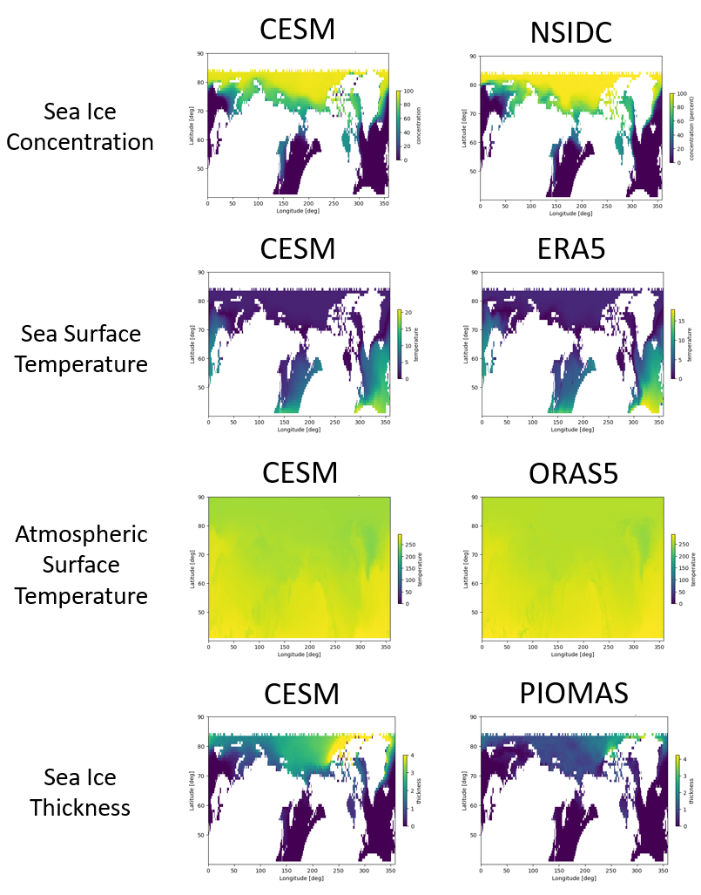

# Preliminary Results

## Additional Climate Variables as Observables

We continue the development of the HAIKU system by including additional climate variables in the FKPM training. In particular, sea (potential) temperature, atmospheric temperature, and sea ice thickness were added. These generally improve the performance of the models and we plan to investigate the inclusion of additional variables (eg. solar irradiance and greenhouse gases).

We compare observational-based and CESM-based FKPMs trained on all climate variables. The mean modes are shown in Figure 4 and match expectation for the time average of these variables across the training interval.

<figure>

<figcaption align = "center" style="width:90%"><b>Figure 4:</b> The mean modes are visualized for the CESM-based FKPM (left) and the observational-based FKPM (right). The results are qualitatively similar and also match physical expectations for the time average of these variables.  </figcaption>
</figure>
&nbsp;

The annual modes are shown in Figure 5 and match expectation for the typical annual fluctuation of these variables across the training interval.

<figure>

<figcaption align = "center" style="width:90%"><b>Figure 5:</b> The annual modes are visualized for the CESM-based FKPM (left) and the observational-based FKPM (right). The results are qualitatively similar and also match physical expectations for annual variance of these variables.  </figcaption>
</figure>
&nbsp;

We have preliminary evidence that shows an improvement in modelling the sea ice concentration dynamics with the inclusion of these additional climate variables. We are interested in assessing the quality of the predictions generated from models with additional variables. The Root Mean Squared Error (RMSE) is computed between the monthly predictions of various models and the NSIDC monthly sea ice concentration data in Figure 6.

<figure>

<figcaption align = "center" style="width:90%"><b>Figure 6:</b> Four FKPM were trained with differing sets of climate variables (from observational data) and the pointwise RMSE of monthly Sea Ice concentration is shown (blue) compared to CESM1 data (orange) and the climatological mean (green). We see an accuracy gain when including ORAS5 Atmospheric Temperature (right), but not when including ERA5 Sea Surface Temperature (bottom) compared to Sea Ice Concentrations alone (top-left).   </figcaption>
</figure>
&nbsp;

From this result, it is clear that the FKPM captures the dynamics more accurately with the inclusion of Atmospheric temperature. We speculate that the Sea Surface temperature has little positive impact we cannot obtain the sea surface temperatures in regions that contain sea ice. Including CESM simulated sea (potential) temperatures a few feet below the sea ice as an additional climate variable could improve the accuracy of these models. This will be a nice proof of concept for our Phase II approach to identify new measurements that could improve the accuracy of models built from observational data.

## Inclusion of forcing terms in the model
Global Climate Models (GCMs) such as the Community Earth System Model (CESM) are driven by forcings such as greenhouse gases and other anthropogenic factors.
We can apply the same forcings to our model to understand the impact of different scenarios on our climate systems.
Figure 7 shows our model’s predictions under two different forcing scenarios: one with constant forcing after 2009, and one with historical forcing.
Importantly, we find that the sea ice dynamics are mostly internally driven with little direct impact from the CO2 forcing.

<figure>

<figcaption align = "center" style="width:90%"><b>Figure 7:</b> – September sea ice area from 1979 to 2027. (Blue) Predictions from a Koopman model trained from 01/1979 to 12/2009. (Orange) Mean of CESM1 ensemble members’ predictions. (Green) CO2 volume mixing ratio. Two scenarios are shown: constant forcing after 2009 (top) and complete historical forcing (bottom). The red star represents a forecast of the sea ice in September 2022 based on the current sea ice: https://www.arcus.org/sipn/sea-ice-outlook/2022/july</figure>
&nbsp;
