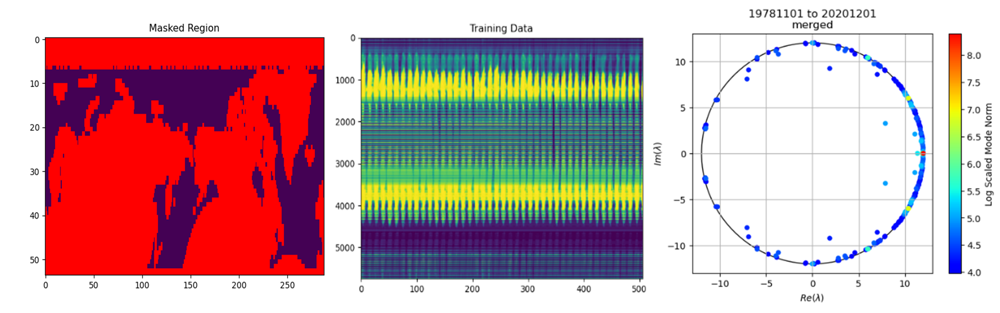
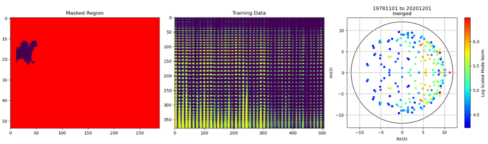

# Preliminary Results

## Additional Climate Variables as Observables

We investigated the evolution of sea ice concentration in specific subregions (<i>this has not yet made it into the publicly released code</i>). In contrast to applying Koopman methods to data from an entire hemisphere, applying the methods to data from a subregion yields more robust models. When we investigate the Barents Sea subregion, we find that the Koopman methods reveal highly decaying dynamics shown in Figure 2. This is in sharp contrast to applying the methods over a larger spatial region, which reveal dominant stationary dynamics shown in Figure 1. This is not surprising, as the visualizations of the training data in Figures 1 and 2 indicate that the majority of the data in the northern hemisphere is stationary, while most of the data in the Barents Sea subregion is decreasing over time.

<figure>

<figcaption align = "center" style="width:90%"><b>Figure 1:</b> – (Left) Koopman methods are applied to data from the entire northern hemisphere. (Middle) 2D plot of the training data from 1978-2020. Each column contains vectorized data from a single point in time. (Right) Koopman eigenvalues extracted from the training data – colored by their contribution to the dynamics in the training data.</figure>
&nbsp;

<figure>

<figcaption align = "center" style="width:90%"><b>Figure 2:</b> – (Left) Koopman methods are applied to data from the Barents Sea subregion. (Middle) 2D plot of the training data from 1978-2020. Each column contains vectorized data from a single point in time. (Right) Koopman eigenvalues extracted from the training data – colored by their contribution to the dynamics in the training data.</figure>
&nbsp;

We find correspondences of the Koopman eigenvalues between the models. We see that the decaying dynamics in the Barents Sea region are roughly captured by the model trained on the entire northern hemisphere. The small differences in the learned dynamics are likely due to the fact that the model trained on data from the entire northern hemisphere is subject to more noise than the localized model trained only on data from the Barents Sea subregion.

Further investigation into using information from the localized models to improve the global model is currently being conducted. This is part of our ongoing work on improving the robustness of the Koopman models.
