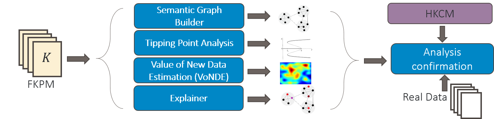
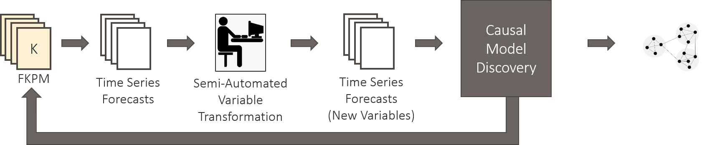
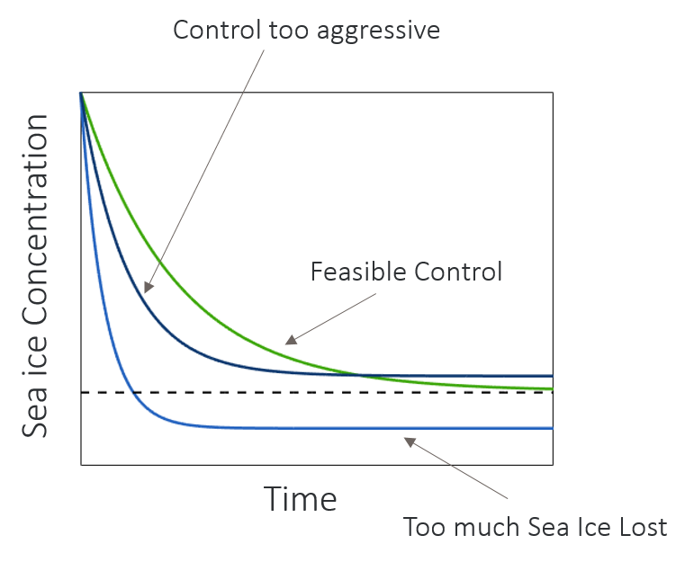

# Analysis Toolkit
Our extensible toolkit leverages data from the fast counterfactual simulation of the FKPM (Figure 1). 
We highlight several planned analyses below, but envision the set of analyses growing to meet the needs of our key analytic questions. FKPM provides the computational engine enabling the analyses, and we leverage HKCM as a validation tool. 
These components are still in development and will be expanded upon as the implementation is finalized.

<figure>

<figcaption align = "center" style="width:90%"><b>Figure 1:</b> HAIKU includes an extensible analysis toolkit that leverages the FKPM to run millions of What-Ifs in support of explanatory, exploratory, and quantitative analyses.</figcaption>
</figure>    

##Semantic Graph Builder
The Semantic Graph Builder will build a causal network of key causal factors impacting forecasts, augmenting the set of model factors with user-defined factors computable from the model (e.g., annual variation in sea ice concentration). 
The FKPM will generate many time series of these factors. We plan to leverage Granger Graphs to apply Granger causality to every pair of factors.  
This captures the causality between factors given the generated time series. 
This summary of the climate model will improve understanding by showing predictions and connections in terms of the variables that are most meaningful.

<figure>

<figcaption align = "center" style="width:90%"><b>Figure 2:</b> Illustration of the Semantic Graph generation which provides a human interpretable representation of climate dynamics in a compact causal graph.</figcaption>
</figure>    

The model will be built out by initially calling on the FKPM to generate a large bank of time series for all outputs of interest. This data is then processed by a semi-automated variable transformation which aims to reduce the gridding of the input data to something both meaningful and manageable to a human operator.  We anticipate this being mainly manually defined to begin with (eg. spatial averaging over seas, spatial averaging over length scale of interest, etc.).

We then compute pairwise Granger causality between variables and leverage LASSO to limit the number of edges and remove edges explained by other pathways. Similarly, we allow for some physics/expert based constraints on causality (eg. spatial proximity requirements).

We also envision that the definition of causal variables and discovery of causation between them may be beneficial as a feedback mechanism to tune the parameters of the FKPM itself. Specifically, we may identify regions which could be grouped together in the lifting or eigenfunctions of the FKPM to reduce complexity while maintaining causal prediction power.

We anticipate this tool being useful for exploration and understanding of why climate models or climate data behaves as it does. One can quickly vet new models to make sure that the causality present in the Semantic Graph Builder follows physics. Similarly, one can compare a causal model generated from FKPM based on a climate model (CESM) to one on observational data directly to identify potential differences between the two at a high level. 

## Tipping Point Analysis
The Tipping Analysis identifies regions of input space where significant, qualitative differences occur in model prediction under small changes in inputs. 
HAIKU will exploit the linearity of the Koopman Operator to utilize classical results from dynamical systems and control theory, specifically through the eigendecomposition. The eigenvalues identify unstable modes through the sign of the real part. 
Tipping point analysis uses this eigendecomposition in three separate ways to 
1) characterize initial conditions that excite runaway behavior; 
2) locate changes in model parameters that introduce new unstable modes; or 
3) identify points in time that a control, bounded in magnitude, cannot be designed to counteract an unstable mode.

When identifying changes in model parameters or initial conditions that incite runaway behavior, we plan to vary the control values and monitor the change in variables of interest where we may see a tipping point.  We can leverage a shooting method (Figure 3) alongside the speed of the FKPM to quickly sample variable space and identify under what conditions tipping points occur and can be mitigated.

<figure>

<figcaption align = "center" style="width:90%"><b>Figure 3:</b> The shooting method reduces boundary value problems to initial value problems. By modifying a control parameter and running the FKPM forward, we can home in on the boundary value where a tipping point occurs</figcaption>
</figure>    

The possible output of such a shooting method can be seen in Figure 4. 

<figure>

<figcaption align = "center" style="width:90%"><b>Figure 4:</b> In this case, we find that the overall sea ice concentration can be modified through certain controls and we can identify values that lead to irrecoverable sea ice loss.</figcaption>
</figure>    

Through the use of multiple FKPM trained with appropriate input noise or on different data subsets, we can estimate the uncertainty on both magnitude and timing for when a tipping point will occur using a similar approach.

##Explainer
Explainer augments projection models with traceback information to identify key drivers of quantities of interest in the Semantic Graph. 
For example, if a projection shows sea ice concentration decreasing, Explainer identifies the pathways through the graph that accounts for that change. 
Explainer adds interpretability both to ‘baseline’ model projection as well as What-if runs.

The functional details of what will be available in the HAIKU system will be investigated as it is further built out. 
This is viewed as an optional component as this information can be viewed directly by interrogating the causal model itself. 
We intend to keep the model at a manageable size so this function is likely not needed directly.

##Value of New Data Estimator (VoNDE)
The Value of New Data Estimator will estimate the value of new data and help identify where to focus resources for data collection. 
To improve accuracy of climate forecasts and tipping point estimates, HAIKU assesses how new data will contribute to new, previously unseen model parameters or reduces the uncertainly of target specific downstream effects. 
Either case indicates the new data are valuable.