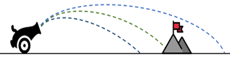

# Analysis Toolkit
Our extensible toolkit leverages data from the fast counterfactual simulation of the FKPM (Figure 1). 
We highlight several planned analyses below, but envision the set of analyses growing to meet the needs of our key analytic questions. FKPM provides the computational engine enabling the analyses, and we leverage HKCM as a validation tool. 
These components are still in development and will be expanded upon as the implementation is finalized.

<figure>

<figcaption align = "center" style="width:90%"><b>Figure 1:</b> HAIKU includes an extensible analysis toolkit that leverages the FKPM to run millions of What-Ifs in support of explanatory, exploratory, and quantitative analyses.</figcaption>
</figure>
&nbsp;  

##Semantic Graph Builder
The Semantic Graph Builder will build a causal network of key causal factors impacting forecasts, augmenting the set of model factors with user-defined factors computable from the model (e.g., annual variation in sea ice concentration). 
The FKPM will generate many time series of these factors. We plan to leverage Granger Graphs to apply Granger causality to every pair of factors.  
This captures the causality between factors given the generated time series. 
This summary of the climate model will improve understanding by showing predictions and connections in terms of the variables that are most meaningful.

<figure>

<figcaption align = "center" style="width:90%"><b>Figure 2:</b> Illustration of the Semantic Graph generation which provides a human interpretable representation of climate dynamics in a compact causal graph.</figcaption>
</figure>
&nbsp;  

The model will be built out by initially calling on the FKPM to generate a large bank of time series for all outputs of interest. This data is then processed by a semi-automated variable transformation which aims to reduce the gridding of the input data to something both meaningful and manageable to a human operator.  We anticipate this being mainly manually defined to begin with (eg. spatial averaging over seas, spatial averaging over length scale of interest, etc.).

We then compute pairwise Granger causality between variables and leverage LASSO to limit the number of edges and remove edges explained by other pathways. Similarly, we allow for some physics/expert based constraints on causality (eg. spatial proximity requirements).

We also envision that the definition of causal variables and discovery of causation between them may be beneficial as a feedback mechanism to tune the parameters of the FKPM itself. Specifically, we may identify regions which could be grouped together in the lifting or eigenfunctions of the FKPM to reduce complexity while maintaining causal prediction power.

We anticipate this tool being useful for exploration and understanding of why climate models or climate data behaves as it does. One can quickly vet new models to make sure that the causality present in the Semantic Graph Builder follows physics. Similarly, one can compare a causal model generated from FKPM based on a climate model (CESM) to one on observational data directly to identify potential differences between the two at a high level. 

## Tipping Point Analysis
The Tipping Analysis identifies regions of input space where significant, qualitative differences occur in model prediction under small changes in inputs. 
HAIKU will exploit the linearity of the Koopman Operator to utilize classical results from dynamical systems and control theory, specifically through the eigendecomposition. The eigenvalues identify unstable modes through the sign of the real part. 
Tipping point analysis uses this eigendecomposition in three separate ways to 
1) characterize initial conditions that excite runaway behavior; 
2) locate changes in model parameters that introduce new unstable modes; or 
3) identify points in time that a control, bounded in magnitude, cannot be designed to counteract an unstable mode.

When identifying changes in model parameters or initial conditions that incite runaway behavior, we plan to vary the control values and monitor the change in variables of interest where we may see a tipping point.  We can leverage a shooting method (Figure 3) alongside the speed of the FKPM to quickly sample variable space and identify under what conditions tipping points occur and can be mitigated.

<figure>

<figcaption align = "center" style="width:90%"><b>Figure 3:</b> The shooting method reduces boundary value problems to initial value problems. By modifying a control parameter and running the FKPM forward, we can home in on the boundary value where a tipping point occurs</figcaption>
</figure>
&nbsp;  

The possible output of such a shooting method can be seen in Figure 4. 

<figure>

<figcaption align = "center" style="width:90%"><b>Figure 4:</b> In this case, we find that the overall sea ice concentration can be modified through certain controls and we can identify values that lead to irrecoverable sea ice loss.</figcaption>
</figure>
&nbsp;  

Through the use of multiple FKPM trained with appropriate input noise or on different data subsets, we can estimate the uncertainty on both magnitude and timing for when a tipping point will occur using a similar approach.

##Explainer
Explainer augments projection models with traceback information to identify key drivers of quantities of interest in the Semantic Graph. 
For example, if a projection shows sea ice concentration decreasing, Explainer identifies the pathways through the graph that accounts for that change. 
Explainer adds interpretability both to ‘baseline’ model projection as well as What-if runs.

The functional details of what will be available in the HAIKU system will be investigated as it is further built out. 
This is viewed as an optional component as this information can be viewed directly by interrogating the causal model itself. 
We intend to keep the model at a manageable size so this function is likely not needed directly.

##Value of New Data Estimator (VoNDE)
The Value of New Data Estimator will estimate the value of new data and help identify where to focus resources for future data collection. 
To improve accuracy of climate forecasts and tipping point estimates, HAIKU assesses how new data will contribute to new, previously unseen model parameters or reduces the uncertainly of target specific downstream effects. 
Either case indicates the new data are valuable.

###VoNDE approach
We can identify potential measurements by tracing the causality of high variability target forecasts back through the structure of the FKPM cross-terms and the Causal Model to identify important climate variables.
These suggest candidate measurements that are likely to be high value, but further analysis is required to verify the effect increased fidelity of these measurements would have on the target forecast.
 
There are a few types of new measurements we consider:

1. **Increased accuracy of current measurements**: We analyze how the output of the model varies as we add noise to the training data.
We rapidly train multiple FKPMs given different sets of noisy training data and quantify how much improvement there is on various model metrics.
2. **Increased temporal resolution of measurements**: We analyze how the output of the model varies as we change the frequency of measurements.
We rapidly train multiple FKPMs given different frequency of training data for the measurement class of interest and quantify how much improvement there is on various model metrics.
3. **Increased spatial resolution**: We analysis how the output of the model varies as we change the spatial grid resolution for measurements or add in a new measurement at a specific location.
We rapidly train multiple FKPMs given different spatial resolution of the training data for the measurement class of interest and quantify how much improvement there is on various model metrics.
4. **Increased precision of model parameters/initial conditions**: We analyze how the output of the model varies as we shift the initial values and model parameters (such as forcing terms) within their measured uncertainty -- rerunning the FKPM many times and quantifying how the model metrics (mainly variability in output) change with respect to the variance in the model parameters or initial conditions.

We then evaluate specific metrics against the above list of experiments to quantify the value of new data:

1. **Forecasting accuracy**: Do the new measurements increase the accuracy of the modeling forecast with respect to the observed data for the target climate variables of interest?
2. **Forecasting robustness**: Do the new measurements increase the robustness of the modeling forecast to perturbations in the initial conditions or model parameters?
3. **Tipping point accuracy**: Do the new measurements increase the accuracy of the magnitude and timing of a forecasted tipping point?
4. **Tipping point robustness**: Do the new measurements increase the robustness of the magnitude and timing of a forecasted tipping point to perturbations in the initial conditions or model parameters?
5. **Causal Robustness**: Do the new measurements significantly alter the causal links discovered between climate variables of interest when comparing different FKPMs?

These Value of New Data analyses can then be compared with the expected cost of obtaining additional measurements or reducing uncertainty on existing measurements.
This is a necessary capability to properly determine how best to invest funds in climate research.

###VoNDE datasets 
We have identified several potential measurements that could improve modeling of sea ice concentration in the Arctic that are known to be relevant to the physics in question while being poorly estimated from observed data.
If we are able to quantify the improvement to forecasting ability of sea ice, particularly related to tipping points, we can then weigh the cost of collecting more measurements or developing better methods of estimating those measurements from current data.
Specifically, Cloud cover measurements, under ice water temperature measurements, and atmospheric heat flux measurements are poorly estimated and rarely directly measured for the Arctic region while likely having a large impact on the dynamics of sea ice concentration.
We will focus on cloud cover measurements for their potential to improve the sea ice concentration models in Phase II of DARPA ACTM. 
Details can be found [here](https://bae-systems-haiku.github.io/HAIKU/data_models/#cloud-cover-data-to-support-value-of-new-data-estimator)
Additionally, we will use the [Atmospheric Temperature datasets](https://bae-systems-haiku.github.io/HAIKU/data_models/) currently in the HAIKU analysis to validate our approach by reducing the fidelity of the dataset.

####Why cloud cover?
In the Arctic climate system, physical properties of clouds, such as amount, height, optical thickness, size of cloud droplets and phase partitioning are known to be key factors in determining the surface heat budget over a broad range of time scales due to their radiative effects. 
These properties display distinct seasonal variations and are subject to complex interactions with the atmosphere, ocean, sea ice, aerosols and large-scale circulation. A better understanding of the role of the summer low-level cloud in shaping sea ice is particularly critical since low-level clouds (bases <3 km) have a greater impact on the Arctic surface energy budget than clouds at higher levels, owing to their proximity to the surface, frequent occurrence, higher emission temperatures, as well as the possibility that they are more often composed of supercooled liquid. 
These features make summertime low-level clouds more effective at emitting downwelling longwave radiation, while high reflectivity of low-level clouds can also alter downwelling shortwave through changing cloud transmittance and multiple-reflection between the surface and low clouds. 
Thus, summertime low-level clouds are one of the most important factors in the Arctic climate system since they can effectively modulate the net surface radiation and consequently the rate of summer sea ice melt.

####Validation datasets
We intend to apply the VoNDE approach to determine the value of measurements not currently available. 
As such, we do not have an adequate dataset to validate the VoNDE approach on cloud cover dataset directly.
We will use the [Atmospheric Temperature datasets](https://bae-systems-haiku.github.io/HAIKU/data_models/) (CESM and NSIDC) currently in use by HAIKU as a validation dataset instead.
Specifically, we will train the HAIKU models with degraded versions of the validation dataset (add noise to each measurement, reduce spatial resolution of measurements, reduce temporal resolution of measurements).
We then use the HAIKU rapid what-ifs generated by the FKPMs to estimate the reduction of uncertainty on tipping points and model accuracy if we reduce the improved the validation measurements in ways corresponding to the full dataset.
We can then finally evaluate the Value of New Data estimation on this dataset.
By measuring the accuracy of our VoNDE estimates across a range of “new” measurements, we can validate the approach and roughly estimate the accuracy of the VoNDE when applied to potential new measurements, such as improvements to cloud cover measurements.
