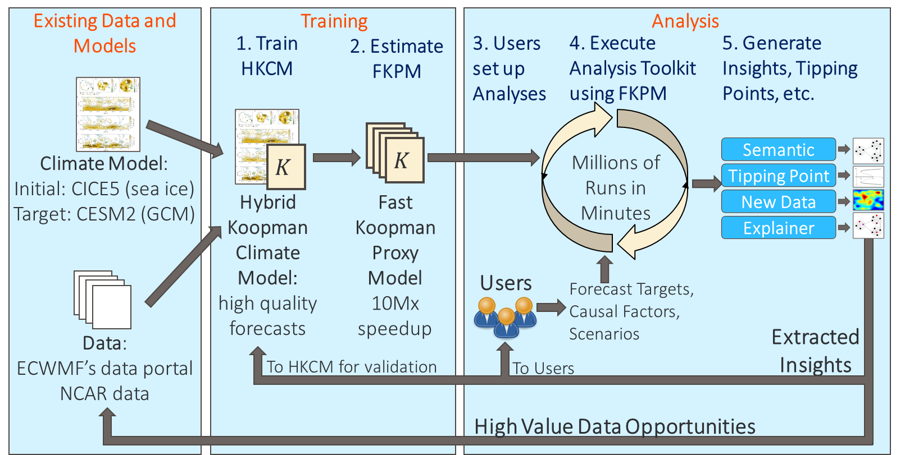

# HAIKU (Hybrid AI Integrating Koopman Units)
##Overview
As part of the AI-assisted Climate Tipping Point Modeling (ACTM) program through DARPA, the HAIKU's Climate Model augmentation and analyses (Figure 1) works to develop more accurate predictions of Climate Tipping-Points and their underlying causes. 
This approach makes use of Koopman Operator Theory. 
Koopman based models are able to represent complex dynamics with similar fidelity to much larger models with drastic improvements to speed while providing some intrinsic explainability. 
This approach enables analyses that allow us to identify causal relations between factors of interest in climate systems as well as to point to additional data or interventions that may mitigate undesired climate effects. Figure 1 summarizes the approach.

<figure>

<figcaption align = "center" style="width:90%"><b>Figure 1:</b> HAIKU Architecture. HAIKU augments conventional climate models with the Hybrid Koopman Climate Model (HKCM) by learning previously umodeled dynamics of error between simulated data and measurements.</figcaption>
</figure>

The Fast Koopman Proxy Model (FKPM) is a learned fully Koopman based proxy model that enables causal analyses and experimentation by this speed-up. 
Finally, a graphical causal model allows users to visualize and interact with the FKPM and better understand the origin of tipping points and uncertainty in the model.

## Problem of Interest: Sea Ice Levels in the Arctic
The recent decline in Arctic sea-ice coverage, thickness and volume has been dramatic, with the September sea-ice extent declining by about 40% during the past 40 years0 and sea-ice volume by about 70% over the same time period1. 
Some projections indicate the Arctic climate system will approach the tipping point of an irreversible catastrophic ice-sheet disintegration, sea-level rise, and the disappearance of the perennial sea ice within this century. 
This tipping point primarily results from Arctic amplification which is believed to be driven by soaring anthropogenic forcing and associated positive feedback loops.

Whereas conventional climate models enable impressive gains in understanding and forecasting, they suffer from several shortcomings. 
Most notably, these include complex physics that are difficult to represent, large computation requirements, and limited explanatory power for emergent behavior, such as tipping points. 
In the Arctic case, the global climate model (GCM) we propose to use, the Community Earth Science Model (CESM2), requires about 6 hours of a 
supercomputing cluster per simulated year. 
Moreover, conventional climate models have limitations with some examples being surface albedo2, sensitivity of ice loss to warming3, 
cloud fraction4, and cloud radiative forcing5.

Focusing on one example – limitation of sensitivity to ice loss warming: with current models of sea ice concentration in the Arctic is that in data, we see a very strong coupling between ocean temperature and sea ice level.
But the current climate models are only able to represent this coupling at a much weaker level and generally require much greater temperature increases than observed to generate the observed level of sea ice loss3. 
A model that is able to represent this observed coupling and explain what physics interactions are missed by the current models would be a boon to the field. 

Additionally, sea ice volume cannot be monitored continuously; it is a challenge to record these measurements in such a remote location. 
If we are able to assess the value of acquiring new measurements in specific locations at specific times that will have an outsized impact on generating accurate models and predictions, we may be able to improve current models and better quantify and mitigate catastrophic sea ice disintegration in the Arctic.

More details about the Global Climate Model and associated data can be found in the [Data and Climate Models](data_models) section alongside the plans for their use in HAIKU.

## Koopman Modeling
The Koopman evolution equation, **Ψ**(t+1) = K **Ψ**(t), is the closed-form climate dynamics equation we use. In a controlled climate system, we describe the evolution of climate states or observables as **x**(t+1)=F1 (**x**(t),**u**(t),θ) where t is the time index, **x** is the climate model state vector, **u**, is the vector representing climate forcing, and **θ** is the vector representing strength of climate interactions. We apply a lifting function to go from the states or observables known to current climate models into a set of collective observables that the Koopman operator can operate on: **Ψ**(t+1)=A(θ)**Ψ**(t)+B(θ)**u**(t).

More details of Koopman Operator Theory and its application to HAIKU can be found int the [Koopman Assisted Climate Models section](koopman).

##References

0 “Arctic Sea Ice Minimum.” NASA Global Climate Change. (https://climate.nasa.gov/vital-signs/arctic-sea-ice/) accessed 10/09/2021.

1 “PIOMAS Arctic Sea Ice Volume Reanalysis.” Polar Science Center. (http://psc.apl.uw.edu/research/projects/arctic-sea-ice-volume-anomaly/) accessed 10/09/2021.

2 Karlsson, J., and Svensson, G. (2013), Consequences of poor representation of Arctic sea-ice albedo and cloud-radiation interactions in the CMIP5 model ensemble, Geophys. Res. Lett., 40, 4374– 4379, doi:10.1002/grl.50768.

3 Rosenblum, E., and I. Eisenman, 2016: Faster Arctic sea ice retreat in CMIP5 than in CMIP3 due to volcanoes. J. Climate, 29, 9179–9188, doi:10.1175/JCLI-D-16-0391.1.

4 Taylor, P. C., Boeke, R. C., Li, Y., and Thompson, D. W. J. Arctic cloud annual cycle biases in climate models. Atmos. Chem. Phys., 19, 8759–8782, 2019 https://doi.org/10.5194/acp-19-8759-2019

5 English, J. M., Gettelman, A., and Henderson, G.R. Arctic radiative fluxes: Present-day biases and future projections in CMIP5 models, J. Clim., 28(15), 6019– 6038, doi:10.1175/jcli-d-14-00801.1.

