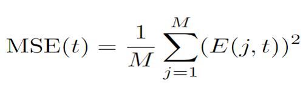
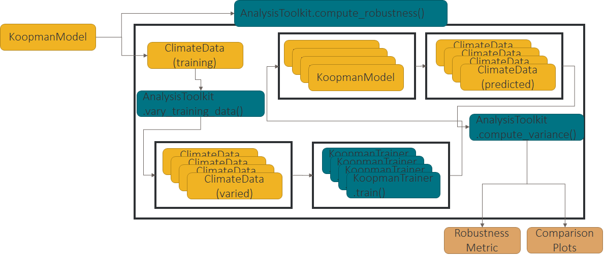
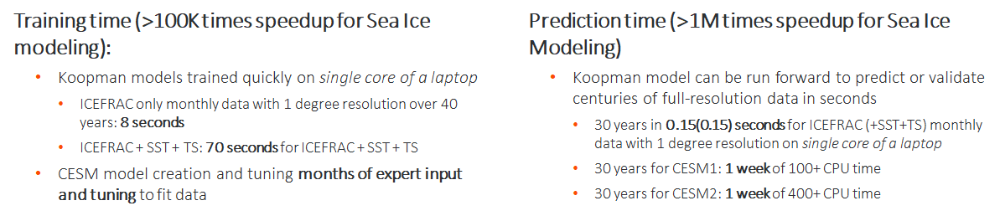

# Metrics to evaulate HAIKU capabilities
In order to evaluate the utility of the HAIKU models and associated analytics compared to current climate modeling capabilities we plan to use several metrics including measuring the relative accuracy and speed of the Koopman Operator Theory based models, the accuracy/reliability of casual relationships extracted from HAIKU, and the accuracy/reliability of tipping points identified by HAIKU.

##Accuracy of climate projections

FKPM can be trained from observational or simulated data. 
Initial accuracy metric will compare the relative accuracy of the FKPM (trained on observation) to Climate model's accuracy and that of the climatalogical mean.
At present we compute relative error of each point at each time step for data outside of training set.

<figure>
<figcaption align = "center" style="width:90%"><b>Equation 1:</b> MSE of a model across all spatial observations at a given time step. </figcaption>

</figure>
&nbsp;  

An example of this accuracy analysis in action can be seen on some preliminary results comparing forecasting from a FKPM trained only on sea ice concentration data to NSIDC data.

<figure>

<figcaption align = "center" style="width:90%"><b>Figure 1:</b> A FKPM was trained on monthly NSIDC (sea ice concentration only) data from 1997-2000. The Koopman model was then run foreward to forecast monthly predictions from 2001-2004. The pointwise RMSE of the FKPM (blue), CESM1 (orange), and climatalogical mean (green) were then computed from the observed monthly NSIDC data. </figcaption> 
</figure> 
&nbsp;  

We plan to average over geographic and temporal step size to better quantify the utility of our models to the longer time scale climate trends as well as to mitigate the potential very small scale noise that the FKPM attempts to simulate.

We plan for this metric to evolve as we continue evaluating the HAIKU system:

   1. Aggregate spatially before computing the RMSE
   2. Compare accuracy of larger scale dynamics to higher resolution
   3. Aggregate temporally (or remove annual variation directly)

Main goal is to assess decadal scale trends and tipping points, we don’t want model to focus on modeling annual variation when overall trend is more important
Compute accuracy per variable/spatial/temporal grids
Will enable Phase II ability to identify measurements to improve overall accuracy

##Robustness of HAIKU models
FKPM models are trained on simulated or observational data, both of these sources have measurement uncertainty in the quantities we aim to model. By quantifying the impact variance on these inputs have in the predictions the koopman model is able to generate, we can define a bounds on the uncertainty of the FKPM predictions.
Specifically, this is done by training multiple koopman models while varying the training inputs within the bounds of their uncertainty. The speed of the training of the Koopman models allows 10s of models to be trained to get a good estimate of the distribution of Koopman models over the parameters of interest.

<figure>

<figcaption align = "center" style="width:90%"><b>Figure 2:</b> Software diagram describing the robustness analytic algorithm in action. </figcaption>
</figure>
&nbsp;  

Analytics of interest include:
   
   1. Robustness to measurement uncertainty 
   2. Robustness to training data parameter choice (CESM variables or NSIDC versions)
   3. Robustness to training window (eg. varying the start/stop of training window by 1 year)
   
Given an FKPM of interest, we can run the above robustness analytics to estimate uncertainty bounds on the forecast of the Koopman models. This will naturally extend itself into the phase 2 value of new data analytic.

##Proxy Model Speedup
The ability of the FKPM to accurately model the climate system is of primary importance, but in order to provide analytics not possible with current climate models, we must also be able to train and test orders of magnitude faster than the current full physics climate simulations. To that end, we propose a metric called Proxy Model Speedup which is the fraction of the time the CESM model takes to evaluate 50 years of climate forecasting at the fidelity described in our datasets section over the time taken for the Koopman model to do the same.

<figure>
<b>Equation 2:</b> Metric to capture speedup of FKPM over standard climate models </figcaption>
<figcaption align = "center" style="width:90%">

</figure>
&nbsp;  

<figure>
Measurement of Proxy Model speedup with HAIKU beta version:</figcaption>

</figure>
&nbsp;  

The measured speedup when leveraging Koopman models allows HAIKU to quickly run many predictions with modified forcing terms, input values, etc to generate the large number of time-series required for causal discovery

The fast training time allows us to modify the fidelity/resolution of training data to evaluate the importance of new data (Phase II).

##Causal Factor Discovery and Confirmation
An important analytic in the HAIKU toolkit is to identify causally linked variables. 

Our current approach at causal discovery involves rapid what-if analyses using the FKPM to tweak potential causal variables and evaluate the change in potential effect variables. We can also identify the off-diagonal terms in the Koopman matrix to infer causality between modes. While our data is high dimensional, we can restrict potential causal links spatially and based on known physics. Once we’ve identified a set of proposed causal links using granger causality in a specific set of FKPMs we then propose a further set of experiments on the original reference climate model via a counterfactual experiment. The accuracy of causal links discovered by the FKPMs is then the fraction of causal links not refuted by high-fidelity models over the total number of proposed causal links.

<figure>
<figcaption align = "center" style="width:90%"><b>Equation 3: </b> Metric to capture the accuracy of the causal links predicted by the Semantic Graph Generator</figcaption>

</figure>
&nbsp;  

Where CF is 0 if a causal links disproved by counterfactual evidence or 1 if it is validated and N is the total number of proposed causal links. If we assume that the sampling of CESM model parameters enclose the true observational parameters, measuring the distribution of Causal Link Accuracies of FKPMs trained on various CESM output should provide a reasonable estimate of the Causal Link Accuracy of a FKPM trained to more precisely emulate the observational data.
An additional metric to track is the total number of causal relations discovered in the climate system. This will be presented, but we do not have a target value at this point. As the program develops and we present hypothesized causal relations to climate scientists, we expect the usefulness of these causal relations may come into play, but no quantitative metrics are currently planned for this.  

##Tipping Point Accuracy and Consistency
FKPM enables what-if analyses orders of magnitude faster than traditional climate models 
Identify Koopman modes with exponential dynamics (likely to cause runaway behavior)
Identify bifurcation by tracking the Koopman eigenvalues
Leverage FKPM rapid what-if analyses to identify causal variables that experience runaway dynamics directly
Given initial conditions and forcing terms, identify point in time where a bounded control is unable to counteract runaway dynamics

Generating a metric to evaluate HAIKU’s ability to accurately predict tipping points is perhaps the most challenging aspect of metric definition. We don’t necessarily have direct observations of tipping points in our observational or simulated data. Identification of key locations and variables driving tipping points will be quantified, but cannot necessarily be verified directly. Specifically, we identify bifurcation by tracking the Koopman eigenvalues and the corresponding Koopman modes; what spatial location and which variables will experience tipping points? We then track the total number and through interactions with climate scientists, how many lead to useful insights or actions.

Quantitative metrics are preferred, so we also aim to verify the accuracy of as many proposed tipping points as possible. We can quantify a stochastic (systematic) uncertainty in the tipping point by measuring the magnitude and causal thresholds that lead to the tipping point across several FKPM trained from data generated with different initial values (configurations) of the CESM.  

For an FKPM trained on climate simulation data, we can go back to the original simulation to verify if a tipping point is present. The FKPM allows us to sample parameter space much more rapidly and the Koopman mode analysis also allows us to identify potential areas to explore. Once we’ve identified potential conditions that trigger a tipping point using our Analysis Toolkit, we return to the original simulations and verify if the predicted tipping point is present in the dynamics of the simulation. This Tipping Point accuracy is the fraction of verified tipping points over the total number of proposed tipping points. 

<figure>
<figcaption align = "center" style="width:90%"><b>Equation 4: </b> Metric to estimate accuracy of tipping points</figcaption>

</figure>
&nbsp;  

Where VTP (verified tipping point) is 0 if the tipping point is not verified on the current FKPM and 1 if it is. We then range over N FKPMs and over M identified tipping points. 

Our currently selected observational data doesn’t have large scale tipping points, so as of now, this analysis is restricted to simulated dynamics. But as with our causal analysis accuracy, we expect that the capability of FKPM to model simulated climate models will be similar to its ability to model observational data. And as such, the Tipping Point Accuracy measured on simulated data should be indicative of that on observational data. Additionally, if a specific tipping point is present in several FKPMs derived across a variety of simulation parameters (high tipping point accuracy) and the accuracy of those FKPMs compared to the observational data is high (high model accuracy), we have reasonable support that this tipping point is properly modeled and is likely representative of a tipping point present in the real earth system.

