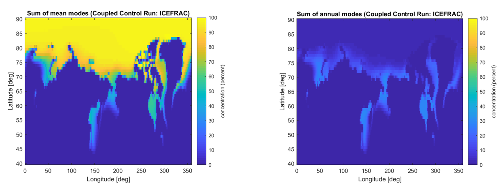
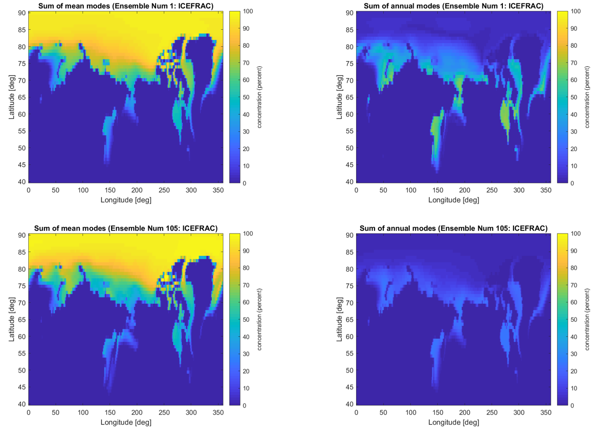
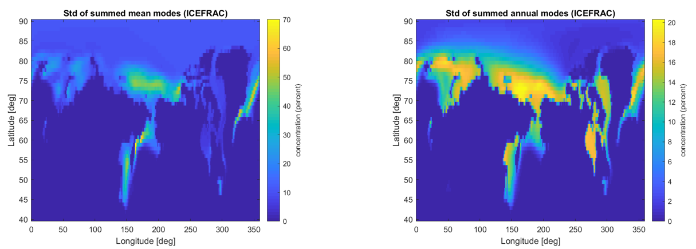

#Preliminary results from Simple Fast Koopman Proxy Model
We’re initially investigating the simulation data from the CESM1 Large Ensemble Community Project. Due to the highly chaotic dynamics of the climate model, small differences in initial conditions lead to vastly different behaviors. 
The ensemble project simulates CESM1 using a constant set of parameters and forcing inputs across all runs. 
The only difference between different ensemble members are perturbations (at round-off error magnitude) on the initial conditions. 
One benefit to the Koopman Mode Decomposition is that while these perturbations can lead to large differences in observable values at a given time-step, they should be treated as noise from the perspective of FKPM. 
We expect to maintain good accuracy and to get very similar coefficients for the FKPM trained across each of the ensembles. All results shown here are of a FKPM that only models the dynamics of the Sea Ice levels provided as output from the full CESM1 simulation. 
This means that we cannot extract causality or execute any what-if analyses outside of self-coupling of sea-ice concentration to itself, but those external forcing functions are represented intrinsically in the output of the CESM1 simulation output.

Before moving to simulations from the CESM1 Large Ensemble Community Project, we perform KMD on a control run that uses constant forcing inputs (instead of the observed historical forcing values). The mean and annual Koopman modes are shown in Figure 1. 
These control simulations do not rely on historical data for forcing inputs and can therefore be simulated for long time horizons.

<figure>

<figcaption align = "center" style="width:90%"><b>Figure 1:</b> Mean (left) and annual (right) Koopman modes obtained from performing KMD on a control run from 1979-2021 in the northern hemisphere.</figcaption>
</figure>

 Figure 2 shows the mean and annual Koopman modes obtained from performing KMD on CESM1 simulation runs #001 and #105 with historical forcing. Koopman models are produced for each ensemble member, while there are some differences in the spectral modes presented, the overall picture is quite similar between the two. The standard deviations of the mean and annual modes are shown in Figure 3. We can see where bias from a specific ensemble selection may come in while training an FKPM.  

<figure>

<figcaption align = "center" style="width:80%"><b>Figure 2:</b> Mean (left) and annual (right) Koopman modes obtained from performing KMD on CESM1 simulations with historical forcing from 1979-2021 in the northern hemisphere. Two members were selected to show typical differences: the top plots show results from member #001 and the bottom plots show results from member #105.</figcaption>
</figure>

 <figure>

<figcaption align = "center" style="width:90%"><b>Figure 3:</b> Standard deviation of the mean (left) and annual (right) Koopman modes obtained from CESM1 simulations with historical forcing between all ensemble members.</figcaption>
</figure>

 Next steps for this preliminary analysis include: comparing FKPMs trained on observational data to CESM1 simulation data which should give a handle on how much we can learn about dynamics that are not explicitly modeled in the CESM1 simulation and thus how much accuracy/precision gain we may get by training the HKCM. Then we’ll begin analyses that include more observable features and begin some what-if experimentation with ensemble of FKPMs.