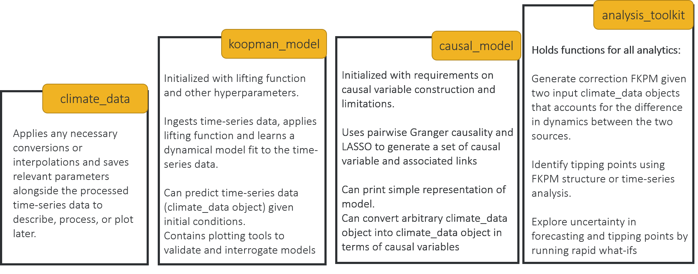
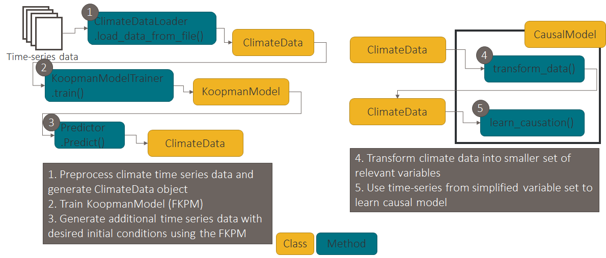
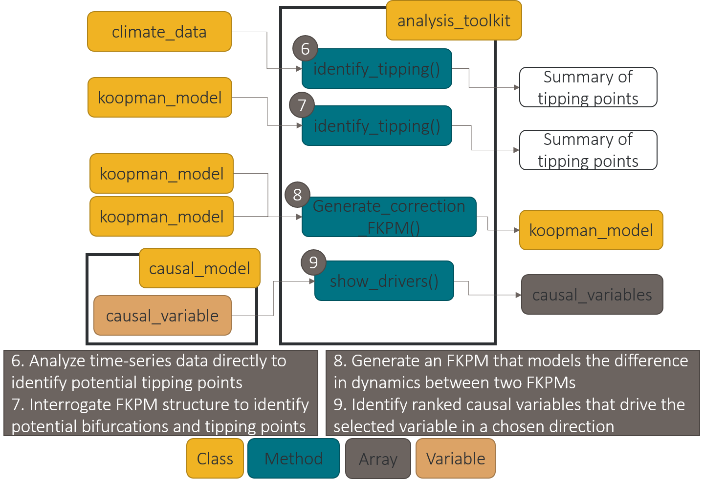

# Software Framework

This is a summary of the structure of the python-based HAIKU software system currently in development.
As the system is developed, a beta version will be available on our public [github page](https://github.com/BAE-Systems-HAIKU/HAIKU).
This page will include steps required to download and preprocess training data,
and to get HAIKU operational on your system.

 \* **_classes_** and _member functions_ are denoted as such section.

 **Overall structure** 

We generate a **_climate_data_** object that can reads in CESM, NSIDC, or Koopman generated data and converts them all to consistent representations (the same coordinate grid and sets of variables) while storing the provenance as a member. 

We have a generic **_parameters_** object that stores any relevant configuration data or other parameters needed in later processing or analysis. For the **_climate_data_** object, this includes this like provenance and time range.

<figure>

<figcaption align = "center" style="width:80%"><b>Figure 1:</b> Main classes in the planned HAIKU software system.</figcaption>
</figure>  
&nbsp;  

The **_koopman_model_** class contains a trained Koopman model and all functions necessary for instantiation, training, and prediction.
The local _parameters_ member stores information about the training parameters and any information necessary to properly use the **_koopman_model_** object. During training, it takes a single **_climate_data_** object and learns the dynamics of this system.
The **_koopman_model_** object can then be used to generate **_climate_data_** with a range of parameters.

<figure>

<figcaption align = "center" style="width:90%"><b>Figure 2:</b> The HAIKU framework ingests data and generates a series of models to enable Tipping Point and other analytics on the climate system.</figcaption>
</figure>
&nbsp;  

Finally, the **_koopman_model_** itself or the time-series data contained in a **_climate_data_** object can be passed into the Analytics Toolkit. A **_causal_model_** object is instantiated and can learn a causal structure from time-series data (**_climate_data_** object) using its internal methods or from the structure of the **_koopman_model_** itself. Similarly, the **_causal_model_**, **_climate_data_**, or **_koopman_model_** objects are used as input to different tipping-point analyses inside the toolkit. 

<figure>

<figcaption align = "center" style="width:90%"><b>Figure 3:</b> Leveraging the generated models and time-series data, several analyses are enabled in the Analytics Toolkit.</figcaption>
</figure>
&nbsp;  

Rounding out the system, there are a variety of metrics that are evaluated either as member functions of the systems or as standalone code.

##Climate Data
The **_climate_data_** class instantiates a time-series member by reading in CESM, NSIDC, or Koopman generated time-series data and converting it to consistent representations (the same coordinate grid and sets of variables) while storing all relevant parameters as a member **_parameters_**.  
The time-series data is stored in a numpy array and is by default monthly data, polar gridded, climate variable data.
It has internal functions to convert between polar and lat-lon coordinates, to interpolate missing datapoints, and to produce time-series matching the lifted Koopman observables (given a **_koopman_model_**).

The **_climate_data_** also has a some plotting methods to investigate visually the temporal and spatial behavior of the data.

The time-series itself is a time-series of a much smaller dictionary, **_climate_state_** which is an array holding the values for climate variables as defined by the gridding of the **_climate_data_**.**_parameters_**.

##Koopman Models
The **_koopman_model_** class contains a trained Koopman model and all functions necessary for instantiation, training, and prediction of the Koopman model on **_climate_data_** time-series.

Several model hyperparameters are set at instantiation by default in the **_koopman_model_**.**_parameters_** object. 
The model is trained through the **_koopman_model_**._train(**_climate_data_**)_ function.

The **_koopman_model_** has a member function, **_koopman_model_**._predict_state(**_climate_state_**:x,dt)_, which returns the predicted **_climate_state_** after the **_koopman_model_** has run the original state, x, forward by time dt. This function lifts the original climate state into the Koopman Observables space before propagating the state forward using matrix multiplication, reversing the lifting function, and producing the predicted state in the original **_climate_state_** format.  There is an associated function for bulk processing of the **_koopman_model_**._predict_state()_ function which can provide a full **_climate_data_** object as output.  This is more commonly used in most analytics.  Currently, the lifting function is a relatively straightforward aggregation of the **_climate_data_**, but we are investigating other approaches as the development continues.

The **_koopman_model_** also has external plotting functions to summarize the model structure including plots of eigenfunctions of selected modes and the distribution of eigenvalues for the **_koopman_model_**.

The forecasting done by the Koopman Models enables the Analytics Toolkit or can produce stand-alone climate forecasts for public consumption.

##Hybrid Modeling
We're still designing the structure of the Hybrid Koopman-Climate Model (HKPM) implementation. 
For the scope of this project we intend to apply a correction on top of pregenerated data from CESM or another climate model rather than running the full CESM climate model locally and applying the correction in place.
This will likely be sufficient to test the HKCM as a proof-of-concept.

The HKPM itself is the correction to apply at each time-step of a climate model.
Input to this system are two **_climate_data_** time-series with the same variables and over the same time-period.
A **_koopman_model_** object is trained on each of the **_climate_data_** objects constraining them to have the same eigenvalues so that they can be compared directly to one another.  The final result is a **_koopman_model_** which is the difference of these two. 

This **_koopman_model_** can then be used directly to provide a correction factor to **_climate_data_** used as input through the **_koopman_model_**._predict_state()_ function.  Alternatively, it enables analytics (currently done manually) to better understand the causal differences between the two models. It is possible to generate a **_causal_model_** object from this data, which may further enable understanding of the physical difference between the original datasets, but further study is required.

###Causal Model

This class requires **_climate_data_** as well as its own member **_parameters_** (which helps define variable transformation from more fine-grained to user oriented causal variables). 
The **_causal_model_**._transform_data(**_climate_data_**) function generates a user oriented **_climate_data_** time-series with many fewer variables. 
This time-series can then be used as input to train the **_causal_model_** where it uses pairwise Granger Causality coupled with LASSO to limit number of edges, remove edges explained by other pathways.

This **_causal_model_** can then be viewed via a **_causal_model_**._print()_ method.

Other analytics are still being considered that may do things like allow a user to request the variable or pathway with the greatest impact on another variable.

##Analytics Toolkit

The initial implementation of the **_analysis_toolkit_** hinges around the **_causal_model_** class. The **_analysis_toolkit_** class is envisioned to hold many various analysis method, but not to hold any objects itself.

<figure>

<figcaption align = "center" style="width:90%"><b>Figure 3:</b> Leveraging the generated models and time-series data, several analyses are enabled in the Analytics Toolkit.</figcaption>
</figure>  
&nbsp;  