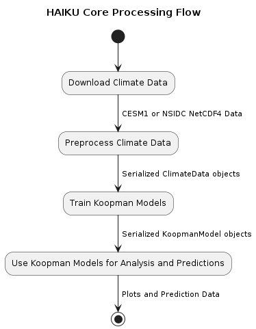
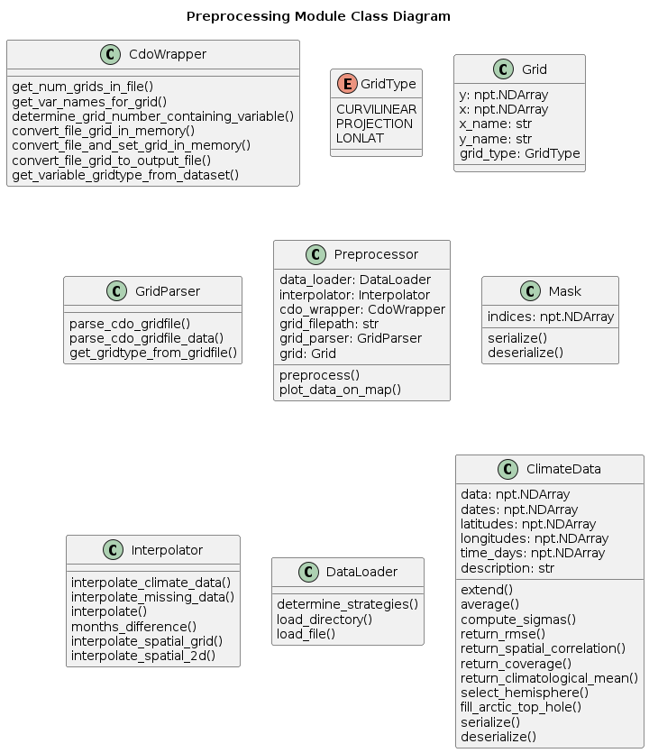
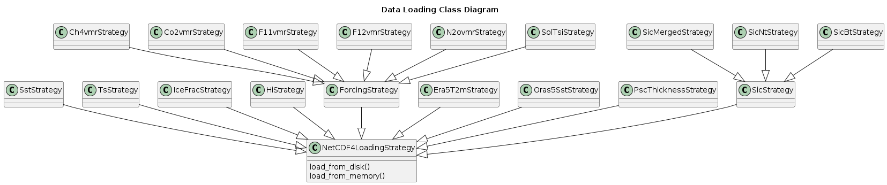
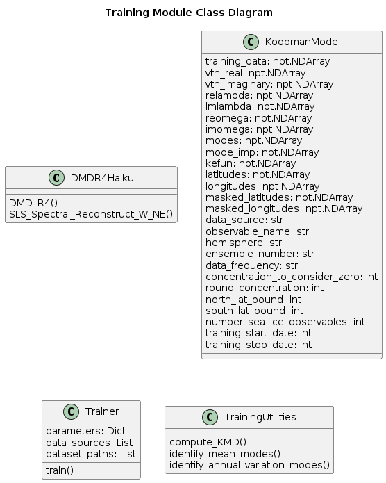

# Software Framework

This is a summary of the structure of the python-based HAIKU software system currently in development.
As the system is developed, a beta version will be available on our public [github page](https://github.com/BAE-Systems-HAIKU/HAIKU).
This page will include steps required to download and preprocess training data,
and to get HAIKU operational on your system.

 \* **_classes_** and _member functions_ are denoted as in this such section.

**General HAIKU Software Flowchart**

<figure>

<figcaption align="center"><b>Figure 1</b>: Software Process Flowchart</figcaption>

</figure>
&nbsp;

The HAIKU Software Architecture encapsulates each of the above flow elements into software modules. These modules decouple logic and enable distributed processing.

Each of the below sections provides a high-level overview of the following HAIKU modules:

- [Preprocessing](../../software_framework/#preprocessing-module)
- [Training](../../software_framework/#training-module)
- [Prediction](../../software_framework/#prediction-module)

## Preprocessing Module

The purpose of the preprocessing module is to generate a **_ClimateData_** object that encapsulates CESM1 or NSIDC data. This data is converted into consistent representations (e.g., same coordinate grid, matching sets of variables, interpolated missing data) and serialized to disk for later use in the pipeline.

<figure>

<figcaption align="center"><b>Figure 2</b>: Classes in the Preprocessing Module</figcaption>
</figure>
&nbsp;

The specific data loading class hierarchy of the Preprocessing module is separated to avoid clutter. Each of the below classes is utilized to extract data for a specific data source.

**_ClimateData_** objects are instantiated by the **_DataLoader_** class which reads in CESM or NSIDC time-series data and converts it to consistent representations (the same coordinate grid and sets of variables). Later in the pipline, **_ClimateData_** can also be produced from a **_KoopmanModel_** object by running the model through the **_Predictor_** object.
The time-series data is stored in a numpy array and is by default monthly climate variable data.
Internal processing converts between polar and lat-lon coordinates, interpolates missing datapoints, and produces time-series matching the lifted Koopman observables (given a **_KoopmanModel_**).

**_PlotFunctions_** further down the pipeline operates on **_ClimateData_** to visually investigate the temporal and spatial behavior of the data.

<figure>

<figcaption align="center"><b>Figure 3</b>: Data Loading Classes in the Preprocessing Module</figcaption>
</figure>
&nbsp;

## Training Module

The purpose of the Training Module is to use ingest a single ClimateData object and learn the dynamics of the represented system using Koopman. The KoopmanModel class contains a trained Koopman model as well as any training parameters associated with the stored data.

<figure>

<figcaption align="center"><b>Figure 4</b>: Classes in the Training Module</figcaption>
</figure>
&nbsp;

The **_KoopmanModel_** class contains a trained Koopman model. The **_KoopmanModelTrainer_** class contains functions necessary for training a Koopman model based on provided **_ClimateData_**. It is used in conjunction with the **_Predictor_** class to generate prediction time-series data in the form of **_ClimateData_**.

## Prediction Module

The purpose of the Prediction Module is to use a single Koopman model to generate Climate Data predictions and produce human-readable analytics (e.g., visualizations).

<figure>

<figcaption align="center"><b>Figure 5</b>: Classes in the Prediction Module</figcaption>
</figure>
&nbsp;

Several model hyperparameters are set at instantiation through the configuration file.

The **_Predictor_** class returns the predicted **_climate_state_** after the **_KoopmanModel_** has run the original state, x, forward by time dt. This function lifts the original climate state into the Koopman Observables space before propagating the state forward using matrix multiplication, reversing the lifting function, and producing the predicted state in the original **_climate_state_** format.  There is an associated function for bulk processing of the **_KoopmanModel_**._predict_state()_ function which can provide a full **_ClimateData_** object as output.  This is more commonly used in most analytics.  Currently, the lifting function is a relatively straightforward aggregation of the **_ClimateData_**, but we are investigating other approaches as the development continues.

The **_KoopmanModel_** also has external plotting functions to summarize the model structure including plots of eigenfunctions of selected modes and the distribution of eigenvalues for the **_KoopmanModel_**.

The forecasting done by the Koopman Models enables the Analytics Toolkit or can produce stand-alone climate forecasts for public consumption.

## Envisioned HAIKU System
The current software implementation of HAIKU supports **_ClimateData_** objects, **_KoopmanModel_** objects, as well as various plotting functions and analysis scripts.
The intended structure isn't fully implemented, many components planned to live in the **_AnalysisToolkit_** currently live in a scripts/ directory (_robustness_analysis()_) or aren't yet implemented (**_CausalModel_**). 
A high level picture for the planned final HAIKU software suite are shown in Figure 6 and described in more detail in this section.

<figure>

<figcaption align = "center" style="width:80%"><b>Figure 6:</b> Central objects to the HAIKU system.  The analytics causal analysis and analysis toolkit are still being built out and are not present in the current release.</figcaption>
</figure>
&nbsp;

###Hybrid Modeling
The final structure of the Hybrid Koopman-Climate Model (HKPM) is still being developed.
We intend to apply a correction on top of pregenerated data from CESM or another climate model rather than running the full CESM climate model locally and applying the correction in place.
Some proof of concept results and thoughts on how this can enhance understanding of the climate system and improve future models can be seen in the [results/HKCM](../../Results/initial_motivation_results/#initial-hkcm-results) section.

The HKPM itself is the correction to apply at each time-step of a climate model.
Input to this system are two **_ClimateData_** time-series with the same variables and over the same time-period.
A **_KoopmanModel_** object is trained on each of the **_ClimateData_** objects constraining them to have the same eigenvalues so that they can be compared directly to one another.  The final result is a **_KoopmanModel_** which is the difference of these two.

This **_KoopmanModel_** can then be used directly to provide a correction factor to **_ClimateData_** used as input through the **_KoopmanModel_**._predict()_ function.  Alternatively, it enables analytics (currently done manually) to better understand the causal differences between the two models. It is possible to generate a **_CausalModel_** object from this data, which may further enable understanding of the physical difference between the original datasets, but further study is required.

###Causal Model

The HAIKU system has no implementation of Causal Modeling in the currently released codebase. But the approach has been designed to support causal models in the future.
The **_CausalModel_**._transform_data(**_ClimateData_**) function generates a user oriented **_ClimateData_** time-series with many fewer variables.
This time-series can then be used as input to train the **_CausalModel_** where it uses pairwise Granger Causality coupled with LASSO to limit number of edges, remove edges explained by other pathways.

Other analytics are still being considered that may do things like allow a user to request the variable or pathway with the greatest impact on another variable.

###Analytics Toolkit
The current Analytics Toolkit capabilities are implemented in the scripts/ directory in the current software implementation.
As more workflows are defined and automated, the Analytics Toolkit class will be implemented to contain several analyses some of which are already completed (initial robustness and tipping point analyses) and others (causal model supported analytics) are not yet supported.

<figure>

<figcaption align = "center" style="width:90%"><b>Figure 7:</b> Leveraging the generated models and time-series data, several analyses are enabled in the Analytics Toolkit.</figcaption>
</figure>
&nbsp;

The analytics toolkit allows for generation of the causal model class and enables the time-series based what-if analyses that can be conducted on the causal variables themselves.

The analytics toolkit will also enable the metrics described in the [Metrics](../../metrics) section.  Specifically, a user will be able to select the metric of interest (eg. robustness to training window bounds) and will automatically run the relevant analysis over the specified parameters and present figures and estimates of the metric in question.
